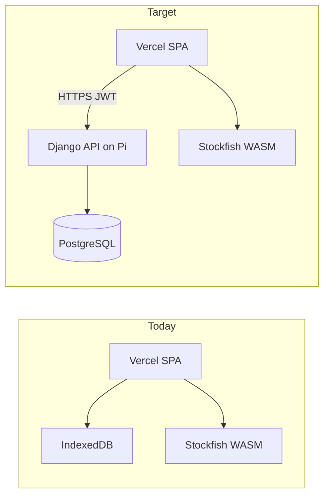
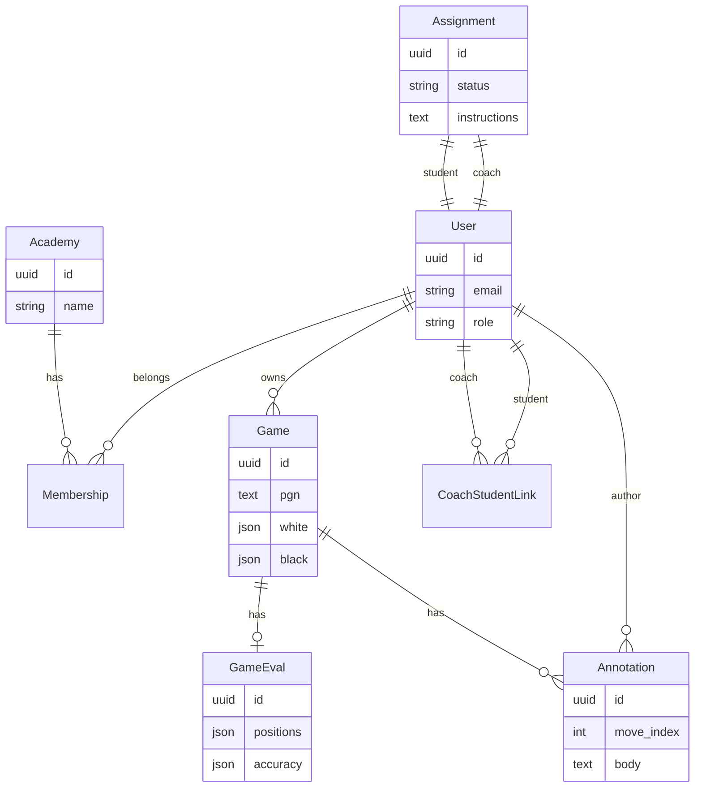
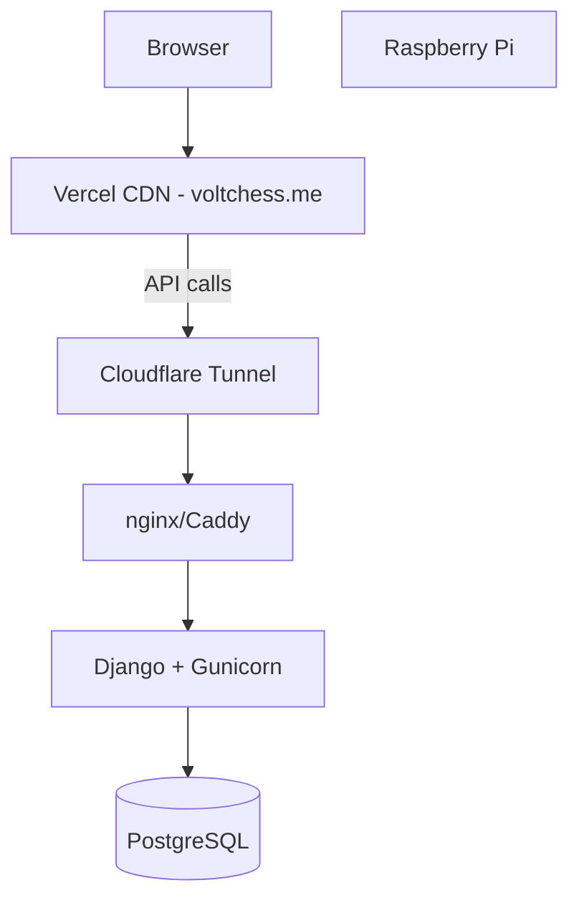

# VoltChess Academy Platform Plan

## Current state

VoltChess today is a **client-first SPA**:

- Analysis runs in-browser (Stockfish WASM); games/evals live in **IndexedDB** via [`src/hooks/useGameDatabase.ts`](src/hooks/useGameDatabase.ts)
- Auth is optional JWT against a **missing** external API ([`src/api.tsx`](src/api.tsx) → `POST /api/token/`, `POST /api/register/`)
- No roles, academies, coaches, students, assignments, or server-side game storage
- Types already map well to a backend: [`Game`](src/types/game.ts), [`GameEval`](src/types/eval.ts)

## Recommended backend stack (Raspberry Pi)

**Django + Django REST Framework + PostgreSQL**

| Why | Detail |
|-----|--------|
| Matches existing frontend | Login/register already expect Django-style JWT (`access`/`refresh`) |
| Academy CRUD fits well | Users, rosters, assignments, permissions are standard DRF patterns |
| Reports & export | Django templates + WeasyPrint/reportlab, or generate PDF/CSV in a background task |
| Pi-friendly | Postgres on Pi 4/5 is viable; use SQLite only for local dev |

**Hosting on Pi**

- `nginx` or `Caddy` reverse proxy → Gunicorn/uvicorn
- **HTTPS**: Cloudflare Tunnel or Tailscale Funnel (avoids port-forward pain at academies)
- Env: `VITE_API_URL=https://api.yourdomain.com` on Vercel; CORS allow `voltchess.me`

**Keep analysis in the browser** for MVP — sync the *result* (`Game` + `GameEval`), not re-run Stockfish on the Pi. Server-side analysis can be Phase 2+ if you need consistent depth across devices.

---

## Domain model (MVP)

**Roles**: `admin` (academy owner), `coach`, `student`

**Permissions (high level)**

- Student: CRUD own games, view own assignments, add annotations on own games
- Coach: view assigned students’ games/reports, create assignments, add annotations on shared games
- Admin: manage roster, invite users, academy settings

---

## Phased rollout

### Phase 1 — Backend foundation (4–6 weeks)

**New repo or `backend/` folder** in monorepo:

- Django project + DRF + `djangorestframework-simplejwt` (refresh token flow — today refresh is stored but unused)
- Models: `User` (custom), `Academy`, `Membership`, `CoachStudentLink`
- Endpoints:
  - `POST /api/token/`, `POST /api/token/refresh/`, `POST /api/register/` (align with [`src/pages/login.tsx`](src/pages/login.tsx))
  - `GET /api/me/`
  - `GET/POST /api/academies/{id}/members/`, invite flow (email link or invite code)
- Pi deploy: Docker Compose (`web` + `postgres` + `nginx`)

**Frontend**

- Replace hardcoded base URL in [`src/api.tsx`](src/api.tsx) with `import.meta.env.VITE_API_URL`
- Wire JWT refresh on 401
- Role-aware nav in [`src/sections/layout/Sidebar.tsx`](src/sections/layout/Sidebar.tsx): Coach Dashboard, My Games, Assignments

### Phase 2 — Game & analysis sync (3–4 weeks)

**Backend**

- `Game` model mirrors [`Game`](src/types/game.ts) (UUID pk, `owner_id`, metadata, `source`)
- `GameEval` as JSON field or normalized `positions` table (start with JSON for speed; optimize later)
- Endpoints:
  - `GET/POST /api/games/`, `GET/PATCH/DELETE /api/games/{id}/`
  - `PUT /api/games/{id}/eval/` (upload after client analysis completes)
  - `GET /api/games/?student_id=` (coach-scoped)

**Frontend**

- New hook `useGameApi` alongside [`useGameDatabase`](src/hooks/useGameDatabase.ts): **hybrid strategy**
  - Logged in → API is source of truth; IndexedDB as offline cache (optional)
  - Logged out / `VITE_ENABLE_AUTHENTICATION=false` → keep current local-only behavior
- After `useAnalyzeGame` completes in [`src/hooks/useAnalyzeGame.ts`](src/hooks/useAnalyzeGame.ts), POST eval to server
- Database page [`src/pages/database.tsx`](src/pages/database.tsx): list server games, filter by student (coach view)
- Migration UX: on first login, “Upload games from this device?” (read IndexedDB → bulk POST)

### Phase 3 — Coach control panel (4–5 weeks)

**New pages** (VoltChess theme, reuse analysis layout patterns)

| Route | Purpose |
|-------|---------|
| `/coach` | Dashboard: student list, recent activity, pending assignments |
| `/coach/students/:id` | Student profile: game list, accuracy trend, critical-move summary |
| `/coach/assignments` | Create/manage assignments |
| `/student` | Student home: my assignments, upload/analyze game |

**Backend**

- `Assignment` model: coach, student, optional `game_id` or PGN text, due date, status
- Aggregates endpoint: `GET /api/students/{id}/stats/` — accuracy avg, blunder/mistake counts, games played (derived from existing `GameEval` classification data used in [`ClassificationGoodBad.tsx`](src/sections/analysis/panel/ClassificationGoodBad.tsx))

**Reuse existing UI**

- Opening a student game → same `/analysis?gameId={uuid}` flow with [`useAnalysisSession`](src/hooks/useAnalysisSession.ts)

### Phase 4 — Annotations & reports (3–4 weeks)

**Annotations**

- `Annotation` model: `game_id`, `move_index`, `fen`, `author_id`, `body`
- Coach/student UI: comment on current move in analysis panel (new tab or sidebar in Report)
- Optional: sync as PGN comments on export

**Per-student performance reports**

- Backend: `GET /api/students/{id}/report/?from=&to=` returns structured JSON (summary + per-game breakdown)
- Export: `GET /api/students/{id}/report.pdf` or client-side PDF via shared JSON (faster to ship: **client generates PDF** from API data using a library; server PDF in v2)
- Report contents: accuracy trend, classification breakdown (Good/Bad columns), critical errors, assignment completion, coach notes

---

## Frontend architecture changes (summary)

| Area | Change |
|------|--------|
| [`src/api.tsx`](src/api.tsx) | Env-based URL, refresh interceptor, typed API modules (`games.ts`, `academies.ts`) |
| [`src/hooks/useGameDatabase.ts`](src/hooks/useGameDatabase.ts) | Split into local + remote adapters |
| [`src/constants.ts`](src/constants.ts) | `VITE_API_URL`, keep auth toggle |
| New `src/pages/coach/` | Dashboard, student detail, assignments |
| [`src/App.tsx`](src/App.tsx) | New routes + role guards (`CoachRoute`, `StudentRoute`) |
| Analysis pages | Read games from API UUID; coaches see read-only or annotation mode |

---

## Deployment topology

- **Vercel**: `npm run build` → `dist/` (unchanged)
- **Pi**: pull API image or git deploy; env secrets for `SECRET_KEY`, DB, CORS origins
- **No game files on Vercel** — static assets only

---

## What to defer (post-MVP)

- Server-side Stockfish analysis (Pi CPU/RAM limits; queue + worker if needed later)
- Multi-academy SaaS billing
- Real-time collaboration (WebSockets)
- Mobile native apps
- Replace IndexedDB entirely (keep offline cache instead)

---

## Risks and mitigations

| Risk | Mitigation |
|------|------------|
| Large `GameEval` payloads | Store summary fields separately; lazy-load full `positions` |
| Pi uptime / home IP | Cloudflare Tunnel; document backup host option |
| Auth + local games disconnected today | Explicit migration + hybrid hook |
| Scope creep | Ship Phase 1–2 before coach UI polish |

---

## Suggested first milestone (ship something usable)

1. Django API on Pi with login + roles + academy roster
2. `VITE_API_URL` wired; games sync to server after analysis
3. Coach page listing students and their synced games with existing Report/Analysis UI

This gives academies a real control panel without rebuilding the analyzer.
